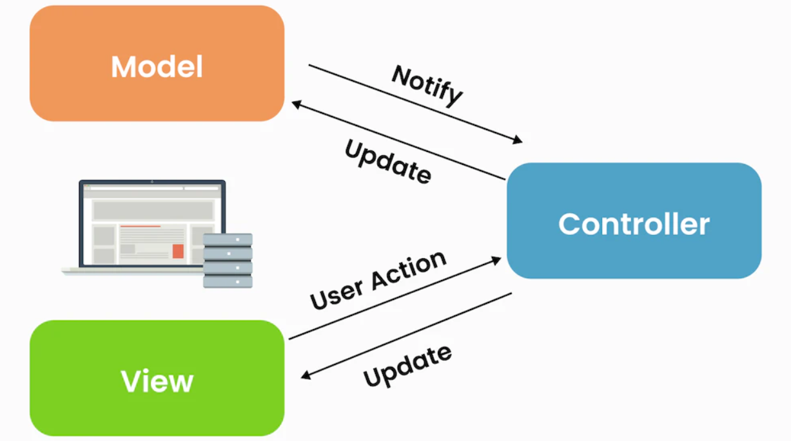
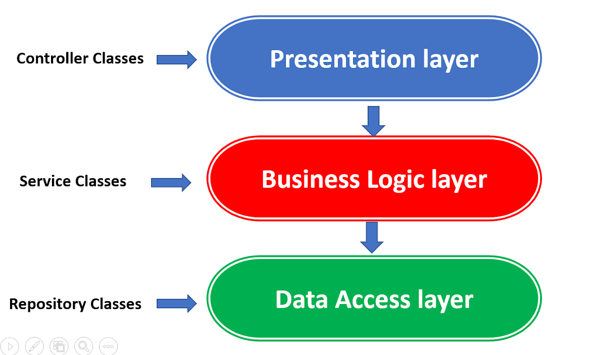
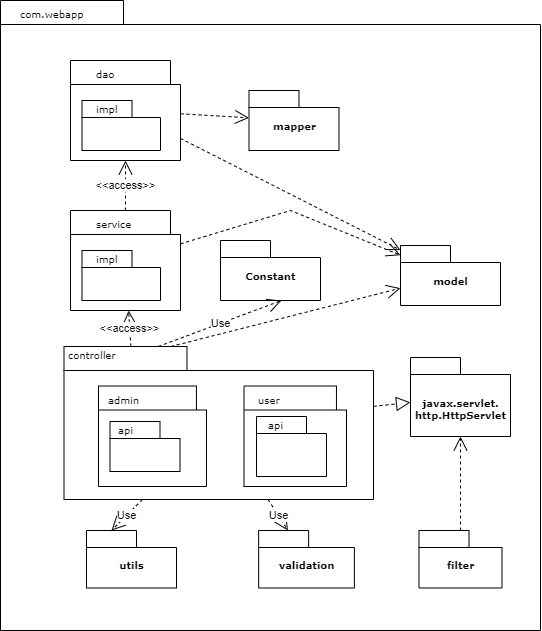
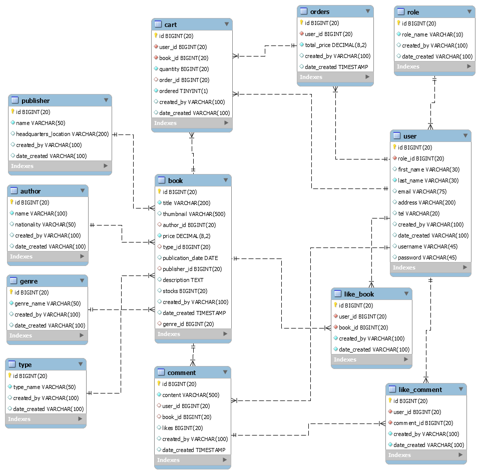

# ONLINE BOOK STORE

# Table of contents :

1. [Introduction](#introduction)
2. [Architecture](#architecture)
3. [Design](#design)
4. [Tools](#tools)
5. [Features](#features)
6. [References](#references)

## Introduction  
### Our team member
| Index | Name                   |     ID      |              Email               | Github             |
|:------|:-----------------------|:-----------:|:--------------------------------:|:---------------------------|
| 1     | Đỗ Đình Phúc | ITCSIU21219 | phucdo2912@gmail.com | dodinhphuc |        
| 2     | Phan Quốc Thắng | ITCSIU21232 | phucdo2912@gmail.com | dodinhphuc | 

### Tasks and Contribution 
| Index | Role                                                         | Person In Charge | Task |
|:------|:-------------------------------------------------------------|:--------------:|:------------:|
| 1     | Leader     |   Đình Phúc   |          Back-end, Middle      |
| 2     | Member      |   Quốc Thắng    |        Front-end, UI design        |

## Architecture  

#### MVC model

#### Three-tier architecture

## Design  

#### Package diagram

#### Logical-database model

## Tools  
**Database:**  
- MySQL

**Back-end:**  
- Servlet, JDBC

**Front-end:**  
- HTML, CSS, JS
- Bootstrap
- Jquery
- Ajax

## Features   

### Usecase diagram

### Implementation
#### Start Screen  

#### Play Screen 

#### Pause Screen 

#### End Screen 

## References  
[1] YouTube.com: Lập trình java web học java web backend lập trình web với java jsp servlet cơ bản miễn phí - Laptrinhjavaweb

